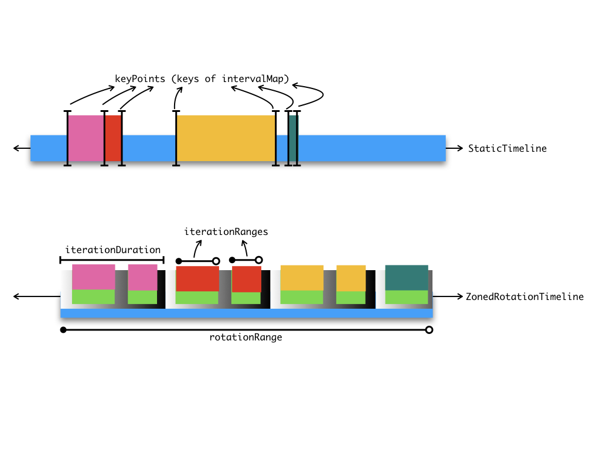
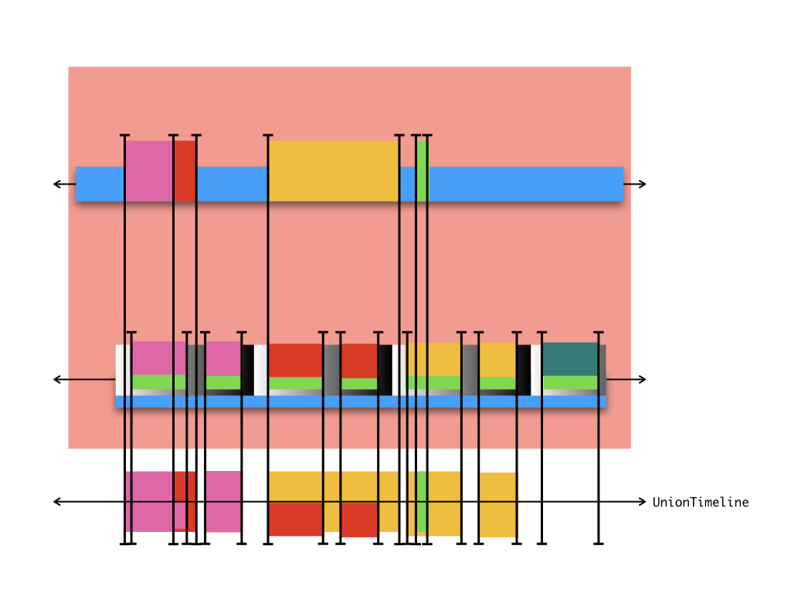
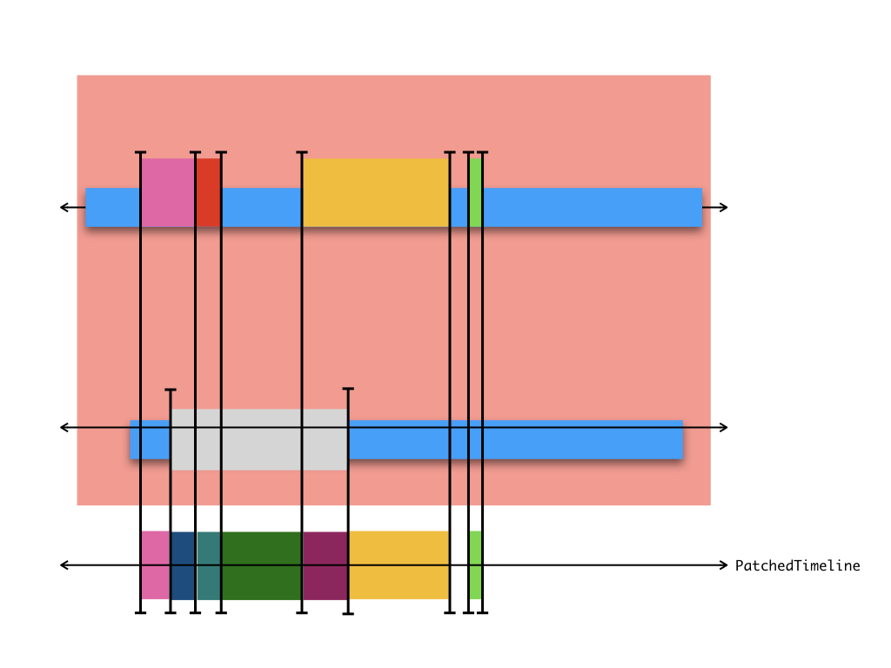
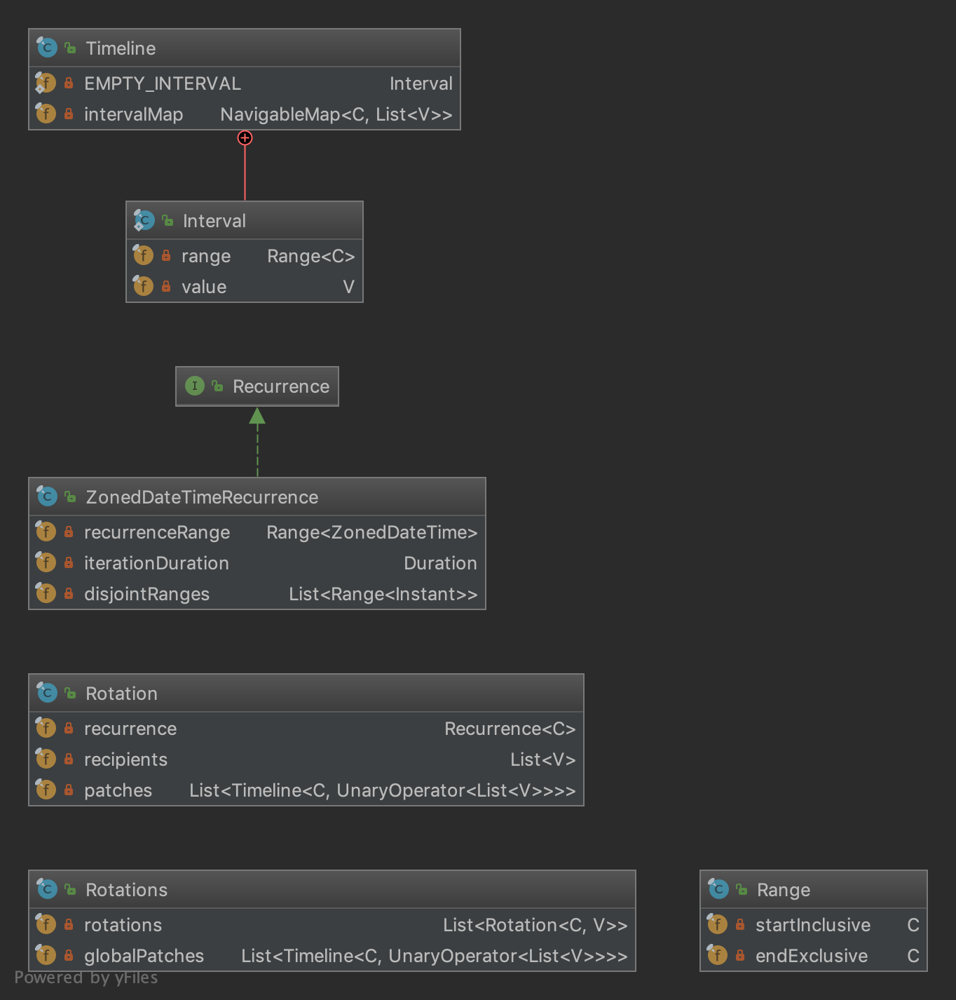

# timeline

Tiny Java library to calculate on-call timelines.

Written in pure Java using zero runtime dependency.

## Dependencies

| Dependency Scope    | Dependencies    |
| ------------------- | --------------- |
| runtime             | (only jdk-8)    |
| compile (provided)  | lombok          |
| test                | junit5          |

## Design

`Range` is a pair of `Comparable` values used as start & end points.

`Interval` is an association between a `Range` and an arbitrary value.

`Timeline` is the base interface of timelines. It has only one method,
namely `TimelineSegment toTimelineSegment(Range<C>)`

`TimelineSegment` is an interface representing a finite segment of
a `Timeline` and allowing to associate its arbitrary sub-segments
(`Interval`s) with a list of arbitrary values.

The `StaticTimeline` implements both the `Timeline` and `TimelineSegment`
interfaces, and uses `NavigableMap` as and underlying 'interval map'
which can be considered as another representation of an 'interval tree'.
This is the most crucial part of the library, since efficiency of all
calculations depends on it.

`UnionTimeline` merges a collection of timelines into one, as the name suggests.

`PatchedTimeline` is a timeline which adds patch support on top of a
base timeline. Patch support is the ability to add, remove, or change
associated values in any part of the timeline.

`ZonedRotationTimeline` represents periodically recurring intervals of a
fixed duration, and assigns the given list of recipients to iterations
one-by-one . This is the only class mentioning `java.time` package.
Unlike previous ones which leaves time point type `C` as generic, this
implementation hard-codes the time point type as `ZonedDateTime`.

## TODO

- Write more granular unit tests
- Make a release
